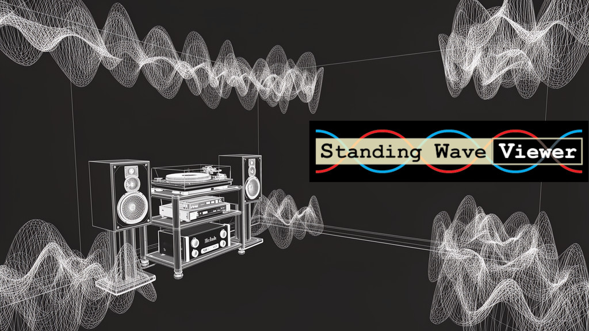
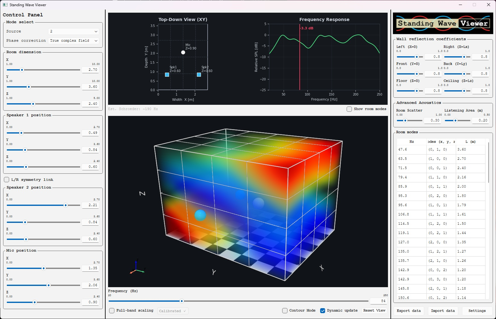

Standing Wave Viewer is a 3D acoustic simulation and visualization tool built with Python, **PySide6 (Qt)**, and **PyVista (VTK)**. It calculates and visualizes room modes (standing waves) and low-frequency interference patterns to help optimize subwoofer/speaker placement and listening positions. To learn technical details behind it, please refer to documents/Q_A_en.md.

Please note that this is an amateur project that began as a personal endeavor, and is not intended to serve as a fully rigorous verification tool for professional use.
I originally created it for myself, with the goal of making it as intuitive as possible to understand the acoustic characteristics of a room. However, now that it’s finished, I feel it has turned into something fairly unique, so I decided to make it available to the public.
If it proves useful to anyone out there, I couldn’t be happier.

## ✨ Key Features

- **Native Desktop UI**: Fully integrated single-window application built with PySide6. The 3D view, 2D graphs, and controls are all visible at once without page reloads.
- **Interactive 3D Room Setup**: Easily adjust room dimensions, speaker coordinates, and microphone positions using slider controls. 
- **Accurate Frequency Response**: Simulates the frequency response (20Hz - 250Hz, adjustable) at the microphone position, accounting for room dimensions and wall reflection coefficients.
- **Volumetric 3D Visualization**: Powered by **PyVista and VTK**, it animates the sound pressure distribution (nodes and antinodes) across the entire 3D room space for any given frequency with high-performance volumetric rendering. The camera viewpoint is perfectly preserved during real-time updates.
- **Advanced Stereo Interference Models**: 
  Supports both Mono and Stereo configurations with three calculation modes:
  - **Uncorrelated (Independent Power Sum)**: Adds acoustic power without wave interference.
  - **In-Phase (Global Cancel - Fast)**: A fast approximation model for phase cancellation.
  - **In-Phase (True Complex Field - Experimental)**: The ultimate physics engine. It synthesizes the exact complex field (real + imaginary parts) across the entire 3D space, perfectly reproducing the spatial warping of wave nodes when subwoofers are placed asymmetrically. Please note that this mode is experimental, and its practicality cannot be guaranteed.
- **Customizable Wall Reflections**: Fine-tune the reflection coefficient (0.0 to 1.0) for all six boundaries (walls, floor, ceiling).
- **Spatial Smoothing**: This feature smooths the signal within a customized radius around the microphone's coordinates to better match how sound is actually perceived. It evens out sharp dips in the In-Phase model.
- **Data Export**: Export your room configurations, frequency response data, and complete room modes directly to a CSV file.
- **Live Settings Tuning**: Dynamically adjust simulation resolutions, grid sizes, and the speed of sound via the built-in Settings dialog without restarting the application.

## Screenshot


## 🛠️ Installation & Usage

### Prerequisites
- Python 3.10+ (Tested with Python 3.14/3.10)
- `PySide6`
- `pyvista`
- `pyvistaqt`
- `matplotlib` 
- `numpy`

### Running the App (Local)
1. Clone the repository.
2. It is recommended to use a virtual environment (`venv`).
3. Install dependencies:
   ```bash
   pip install PySide6 pyvista pyvistaqt matplotlib numpy
   ```
4. Run the application:
   ```bash
   python main_ui.py
   ```

**Linux / Wayland Note:** 
If you are using a Linux distribution with Wayland (e.g., Fedora), VTK might have compatibility issues. The application handles this internally by forcing X11 mode (`QT_QPA_PLATFORM="xcb"`), so no extra launch flags are needed.

---
Disclaimer

This software is provided "AS IS", without any warranty of any kind, express or implied, including but not limited to warranties of merchantability, fitness for a particular purpose, or non‑infringement.
In no event shall the author be liable for any claim, damages, or other liability arising from, out of, or in connection with the software or the use or other dealings in the software.
This software is provided as a reference and educational tool for personal use, and is not intended to serve as the sole rigorous basis for professional‑grade verification, design decisions, or commercial services.
This repository is also not intended as a venue for general discussions or assertions that are unrelated to the actual behavior, usability, or quality of this software.
Such topics are considered out of scope for this project, and issues or comments along those lines may not receive a response.